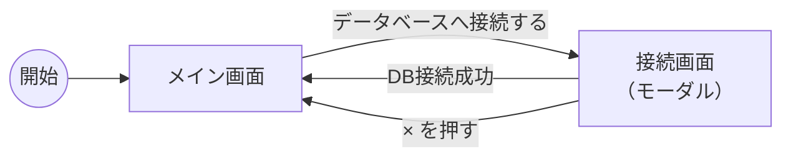

# 画面遷移図

```mermaid
graph LR
    START((開始))
    MAIN["メイン画面"]
    CONNECT["接続画面<br>（モーダル）"]

    START --> MAIN
    MAIN -->|データベースへ接続する| CONNECT
    CONNECT -->|DB接続成功| MAIN
    CONNECT -->|× を押す| MAIN
```

